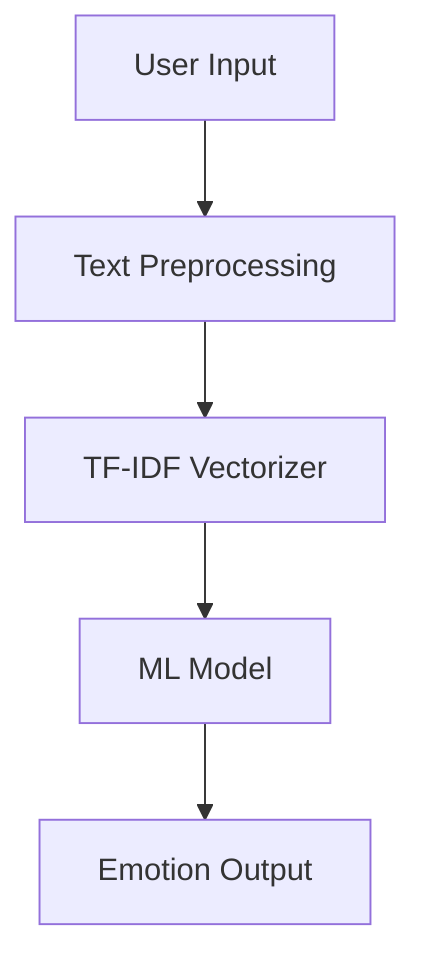

<!-- 🔥 Animated Banner -->

  

<!-- 🔥 Typing Animation -->

  

---

# 🧠 Emotion Detection AI 🚀

  
  
  

---

## 🎥 Live Demo

👉 🔗 https://huggingface.co/spaces/anantmalik125/emotion-detection-ai

  

---

## ⚡ Features

✨ Real-time emotion detection
🎯 ML model + TF-IDF
📊 Confidence score visualization
🎨 Animated UI
🧠 Supports 6 emotions

---

## 🧬 Supported Emotions

| Emotion  | Emoji |
| -------- | ----- |
| Joy      | 😊    |
| Sadness  | 😢    |
| Love     | ❤️    |
| Anger    | 😡    |
| Fear     | 😨    |
| Surprise | 😲    |

---

## 🛠 Tech Stack

  

---

## 🚀 How it Works

---

## 📸 UI Preview

  

---

## 💡 Future Enhancements

* 🎤 Voice Emotion Detection
* 🌐 Multi-language Support
* 🤖 Deep Learning Model
* 🎨 3D UI Animations

---

## 👨‍💻 Author

**Anant 🚀**

  

---

<!-- 🔥 Footer Animation -->

  

